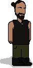

<!--
**DanielAlmazan/DanielAlmazan** is a ✨ _special_ ✨ repository because its `README.md` (this file) appears on your GitHub profile.

Here are some ideas to get you started:

- 🔭 I’m currently working on ...
- 🌱 I’m currently learning ...
- 👯 I’m looking to collaborate on ...
- 🤔 I’m looking for help with ...
- 💬 Ask me about ...
- 📫 How to reach me: ...
- 😄 Pronouns: ...
- ⚡ Fun fact: ...
-->




```swift
// playground.swift

struct Education {
    let title: String
    let type: String
    let startDate: Date
    let endDate: Date
    let school: String
    let EQFLevel: String // European Qualification Framework
    let mainSkills: [String: [String]]
}

struct Dev {
    let name: String
    let middleName: String
    let surnames: [String]
    let birthdate: Date
    var location: String
    var education: [Education]
}

let danielAlmazan = Dev(
    name: "Daniel",
    middleName: "Enrique",
    surnames: ["Almazán", "Sellés"],
    birthdate: Date(timeIntervalSince1970: 707529600),
    location: "Alicante, Spain",
    education: [
        Education(
            title: "Multiplatform Application Development",
            type: "Further Education",
            startDate: Date(timeIntervalSince1970: 1661990400),
            endDate: Date(timeIntervalSince1970: 1717200000),
            school: "I.E.S. San Vicente",
            EQFLevel: "EQF Level 5",
            mainSkills: [
                "C#":  ["OOP", "Entity Framework", "WPF"],
                "Java": ["OOP", "JavaFX", "Threads concurrency", "Hibernate", "SpringBoot"],
                "Android Development": ["Kotlin Activity Views"],
                "DataBases": ["OracleSQL", "PostgreSQL", "MongoDB"],
                "Others": ["Odoo", "Python 3"],
            ]
        ),
        Education(
            title: "Web Application Development",
            type: "Further Education",
            startDate: Date(timeIntervalSince1970: 1661990400),
            endDate: Date(timeIntervalSince1970: 1717200000),
            school: "I.E.S. San Vicente",
            EQFLevel: "EQF Level 5",
            mainSkills: [
                "HTML/CSS": ["HTML 5", "CSS 3", "SASS", "Bootstrap"],
                "JavaScript/TypeScript": ["NodeJS", "NestJS", "Angular 17", "Ionic 7"],
                "PHP": ["Symfony"],
                "Others": ["Docker"],
            ]
        ),
    ]
)

print(danielAlmazan)
```

## Hello, world! 👋

> MAD (Multiplatform Application Development) and WAD (Web Application Development) 
> are two Further Education Higher Degrees EQF Level 5 in Spain.

I'm Daniel Enrique Almazán Sellés. I studied **Multiplatform & Web Application Development** Higher Degrees
(*EQF Level 5*) at IES San Vicente in Alicante, Spain.


## My goals

1. Enhance my skills in Swift, UIKit, and SwiftUI
2. Finishing 700 hours of 'Workplace Training' in your company 😉 (from September 2024 to approx. February 2025)

By February 2025 I'll be looking for a job as a junior developer to start my professional career.
I'm interested in iOS native development, but I'm open to other technologies and platforms.


## Skills reached during my studies

- **JavaScript & TypeScript:** Node.js, NestJS, Angular17, Ionic
- **C#:** OOP, WPF, Entity Framework
- **Java:** OOP, JavaFX, threads concurrency, Hibernate, SpringBoot
- **PHP:** Symfony
- **HTML/CSS:** HTML5, CSS3, SASS, Bootstrap
- **DataBases:** Oracle SQL, PostgreSQL, MongoDB
- **Android:** Development Kotlin Activity Views
- **Others:** Odoo, Python3, Docker

***


## Contact me

- 📫 **[almazansellesdaniel@gmail.com](mailto:almazansellesdaniel@gmail.com)**
- 📱 **[LinkedIn](https://www.linkedin.com/in/daniel-enrique-almazan-selles-26564715b/)** 

## Available repositories

- 📦 **[TaskLynx Docs](https://danielalmazan.github.io/home.html):** Documentation website for the final project of the second year of 
MAD and WAD (the repositories will be private until the end of the course). It's a 'multi-subject' project that includes:
  - NestJS REST API + MongoDB
  - SpringBoot REST API + PostgresSQL DB
  - JavaFX Desktop App (for employers)
  - Android App (for employees)

- 📦 **SplaTank:** These are the repositories of the final project of the first year of MAD and WAD. It's a 2D 
local multiplayer game inspired by Nintendo's Splatoon. It's developed in two different platforms:
  - [C# (Mono Game)](https://github.com/DanielAlmazan/MG_SplaTank)
  - [Java (Swing)](https://github.com/DanielAlmazan/J_SplaTank)
